# ETF Investment Doku

## Linksammlung

- [ETF-Listen](https://www.justetf.com/de/etf-lists.html) (in der Mitte: ETFs auf beliebte Indizes)
- Youtube Video: [4 Steuerstrategien](https://www.youtube.com/watch?v=eAY6iZ6mlyw)

## Thesaurierend vs. Ausschüttend

- thesaurierend: profitiert vom Zinseszins
- ausschüttend: generiert passives Einkommen, was ich derzeit nicht benötige
- Ausschüttung kann allerdings zu einem Steuervorteil führen, wenn sonst der Freibetrag nicht ausgeschöpft wird.
- Entscheidung: **<ins>thesaurierend</ins>**.

## Auswahlkriterien

- thesaurierend
- TER: Total Expense Ratio. A percentage that indicates the annual running costs of an ETF. (Gesamtkostenquote)
  - Da ETFs 'nur' den Index nachbilden, sollte langfristig ein günstigerer ETF auch insgesamt die bessere Performance erzielen.
- Rendite in 1, 2, 3, 5 Jahren
- Volumen
- je länger am Markt, desto mehr verfügbare Daten

## Überlegungen zum Weltportfolio

### MSCI World

- Bildet die Industrieländer exkl. Schwellenländer ab
- Link zu [thesaurierenden MSCI World](https://www.justetf.com/de/find-etf.html?assetClass=class-equity&index=MSCI%2BWorld&groupField=none&sortField=ter&sortOrder=asc&distributionPolicy=distributionPolicy-accumulating)

- Vergleich der zwei <ins>
  **günstigsten**
  </ins> MSCI World mit dem iShares Core MSCI World UCITS ETF USD (Acc)]

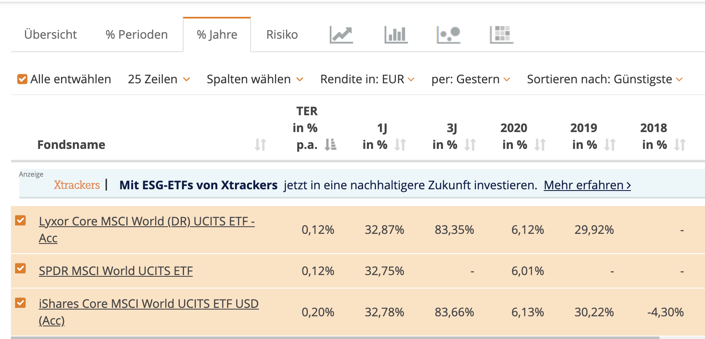

- Beobachtung: eigentlich spielt es keine Rolle, welchen dieser 3 ETF man wählt.

#### Zusammensetzung

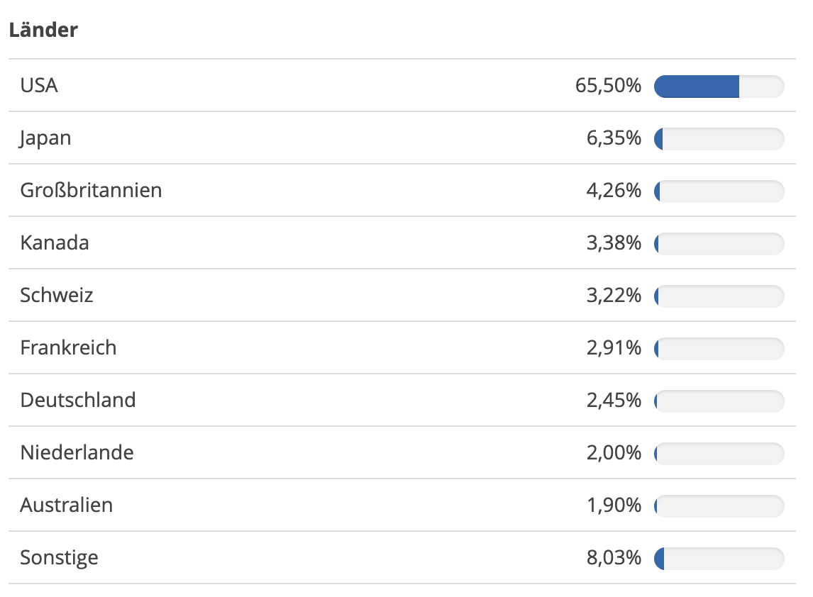

#### Nachteil am MSCI World

- USA ist **_überproportional_** vertreten (>65%). Dies führt zu einem Klumpenrisiko - geht's USA schlecht, geht das Portfolio runter.
- Eine bessere Risiko-Streuung wäre wünschenswert.

### MSCI Emerging Markets

- Bildet nur die Schwellenländer ab
- Link zu [thesaurierenden MSCI Emerging Markets](https://www.justetf.com/de/find-etf.html?assetClass=class-equity&index=MSCI%2BEmerging%2BMarkets&groupField=none&distributionPolicy=distributionPolicy-accumulating&sortField=ter&sortOrder=asc)

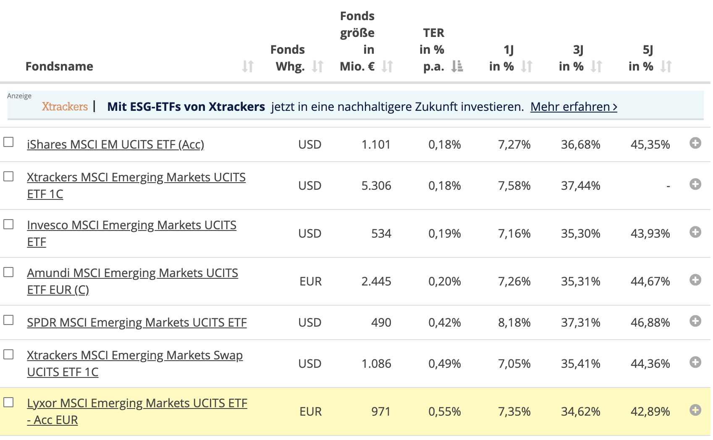

#### Vergleich MSCI World vs. MSCI Emerging Markets

- Link zum [Vergleich MSCI World vs. MSCI Emerging Markets](https://www.justetf.com/de/find-etf.html?groupField=none&sortField=ter&sortOrder=asc&cmode=compare&tab=comparison)
- Emerging Markets im letzten Jahr deutlich schlechter performt.

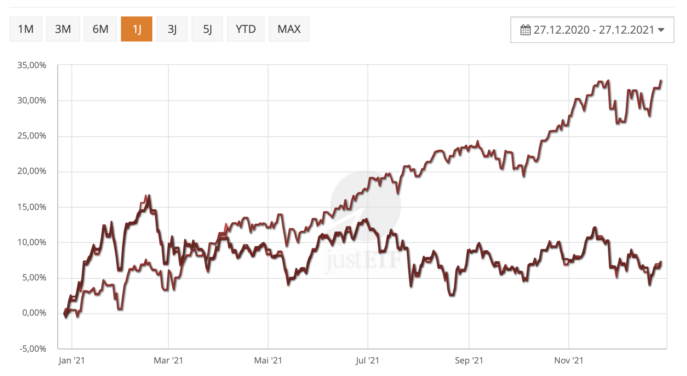

### 50-30-20 Portfolio

- [50-30-20 Portfolio besser? Lohnt sich mehr Europa im Portfolio?](https://www.youtube.com/watch?v=tIQ8UlihLG8)

#### Marktkapitalisierungs vs. BIP

- Marktkapitalisierung eines Unternehmens = Eigenkapitalwert eines Unternehmens an der Börse (Anzahl herausgegebener Aktion x aktueller Börsenkurs)
- Marktkapitalisierung eines Landes = Summe aller an der Börse gelisteten Unternehmens eines Landes
- Nordamerika übergewichtet
  - der Wert nordamerikanischer Unternehmen an der Börse: 55%
  - der Anteil dieser Unternehmen am Welt-BIP ist aber nur 30%
  - im Verhältnis ist die Marktkapitalisierung also zu hoch (Blase?)
  - die eigentliche Wirtschaftskraft ist nämlich deutlich geringer (-25%)
- Schwellenländer untergewichtet (Marktkapitalisierung sollte doppelt so hoch sein!)
- Europa untergewichtet

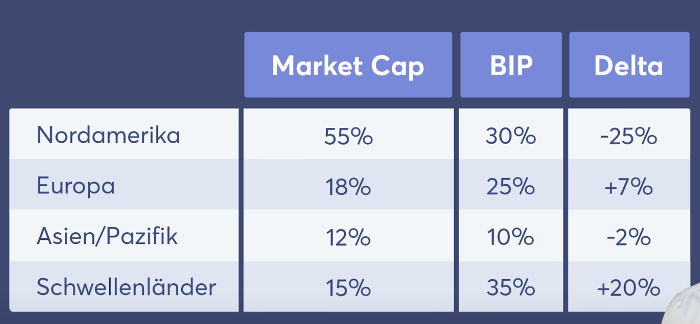

#### 2 Möglichkeiten das starke Gewicht der USA zu reduzieren

1. Gewicht der Schwellenländer im Portfolio erhöhen: 70:30 Portfolio
   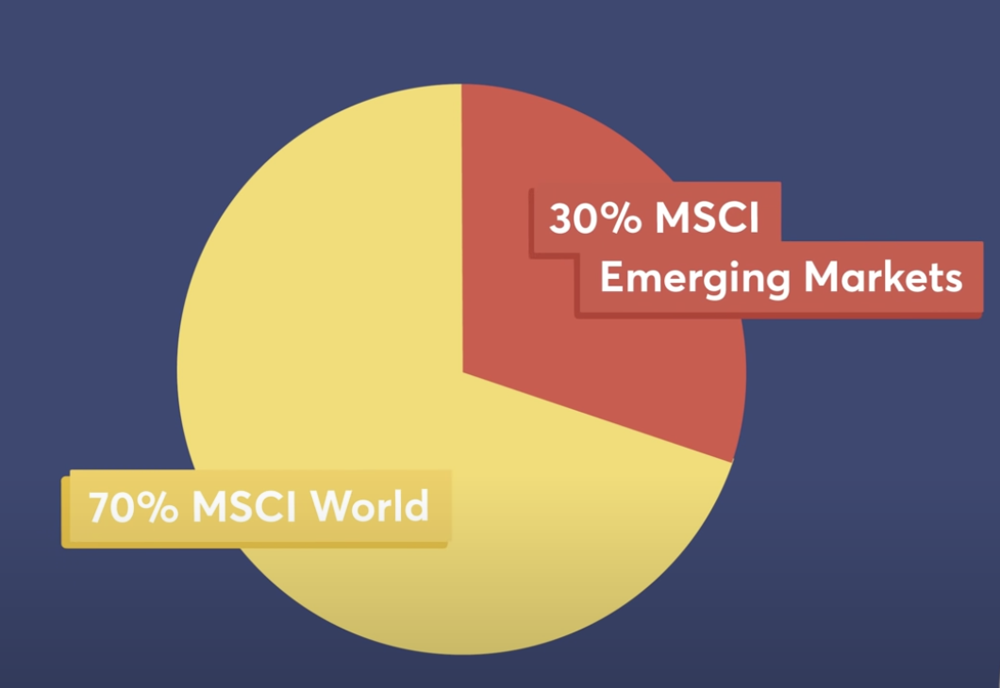

2. Europa-Anteil im MSCI World erhöhen

   1. MSCI World IST
      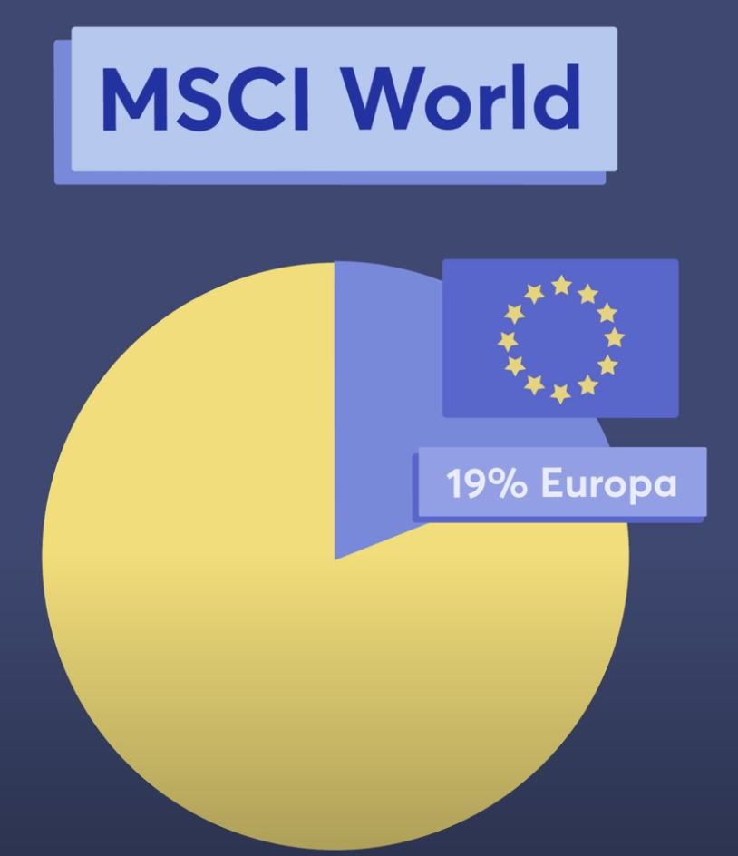

   2. Gewichtung SOLL nach BIP

      > Da der MSCI World die Schwellenländer ausschließt, müsste die **Gewichtung von Europa im MSCI World bei 40%** liegen (Europas BIP: 25% im Verhältnis zu den 65% BIP der Welt ohne Schwellenländer (35%): 25% / 65% = 38,46%)

      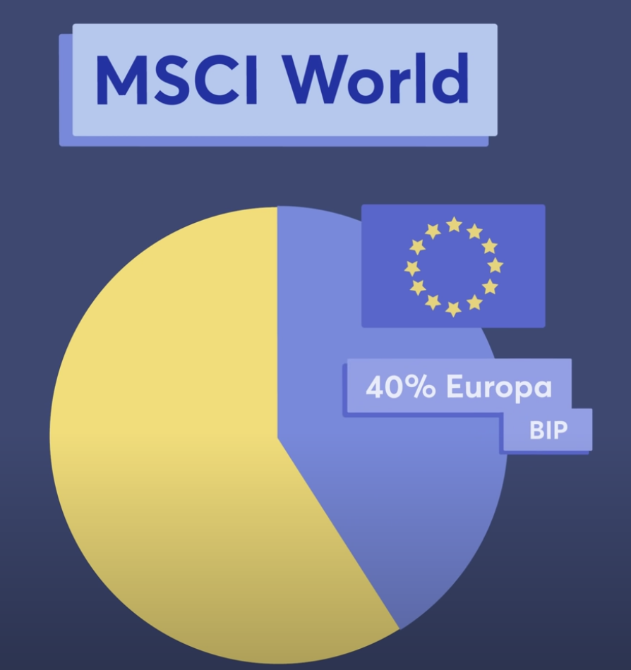

   3. Zielbild

      > Anteil Europas verdoppeln

      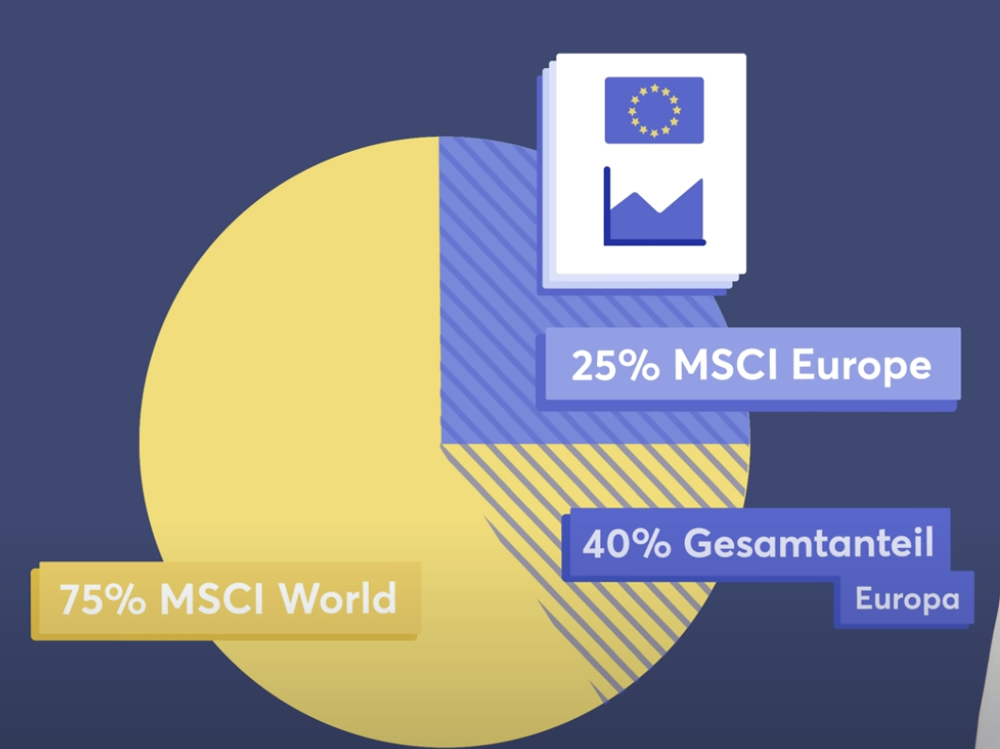

   4. Beibehalten des 70:30 Konzepts

      > 70% Industrieländer, 30% Schwellenländer

      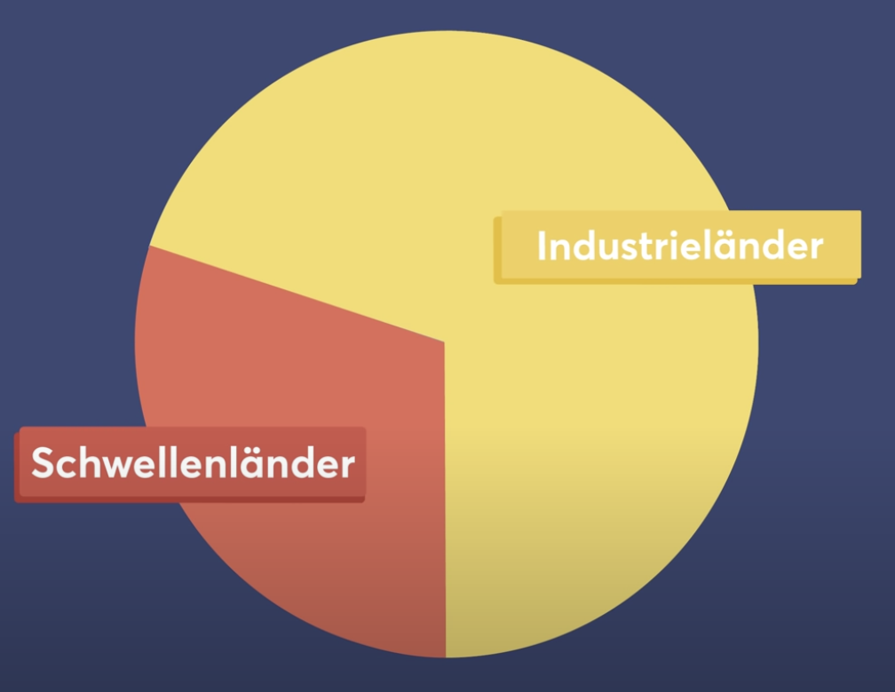

   5. Auteilen des Anteils der Industrieländer
      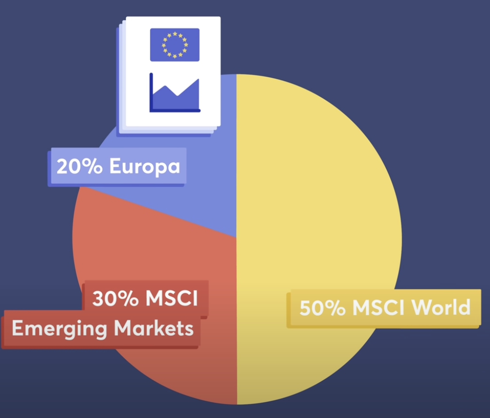

#### Mögliche Europa Indizes

> Von oben nach unten stärkere Diversifizierung

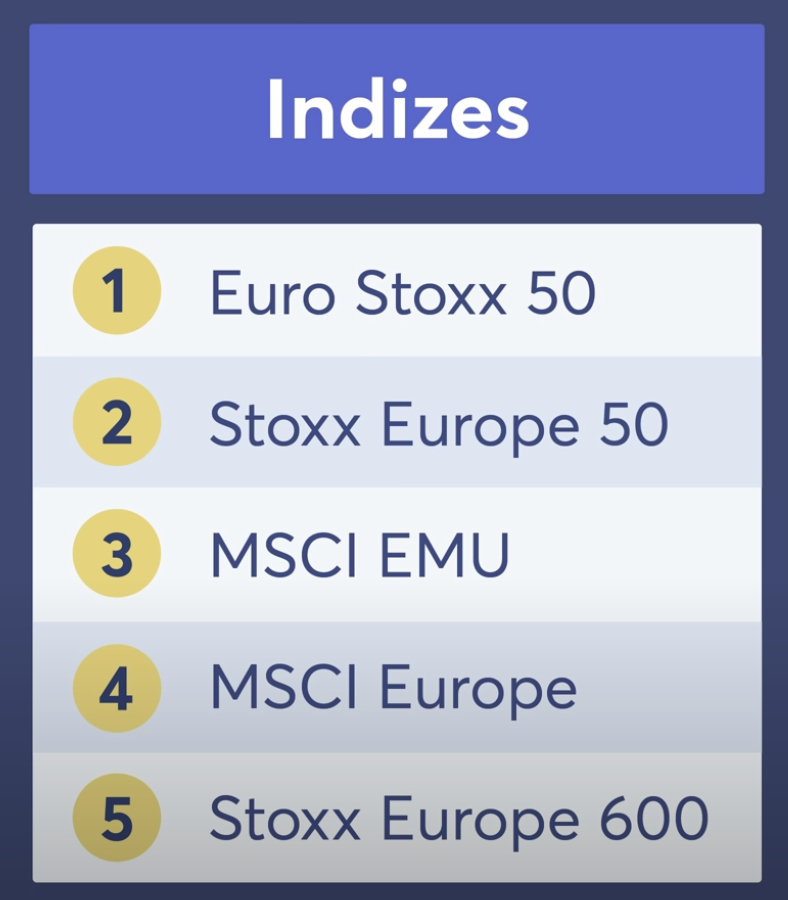

- MSCI Europe: 15 Länder, 500 Unternehmen
  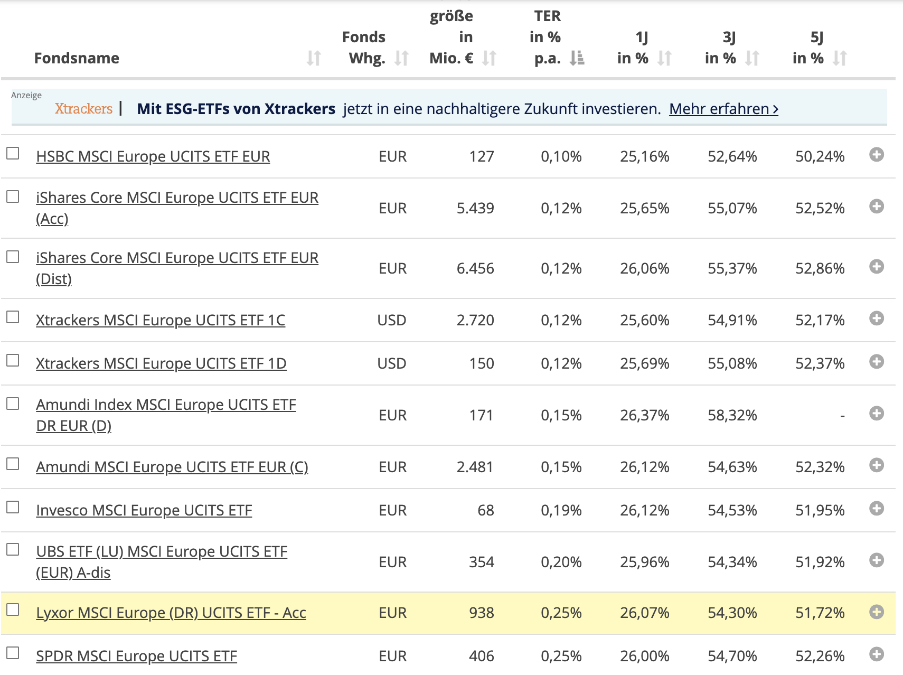

- Stoxx Europe 600: 17 Länder (zusätzlich Polen und Luxemburg), 600 Unternehmen
  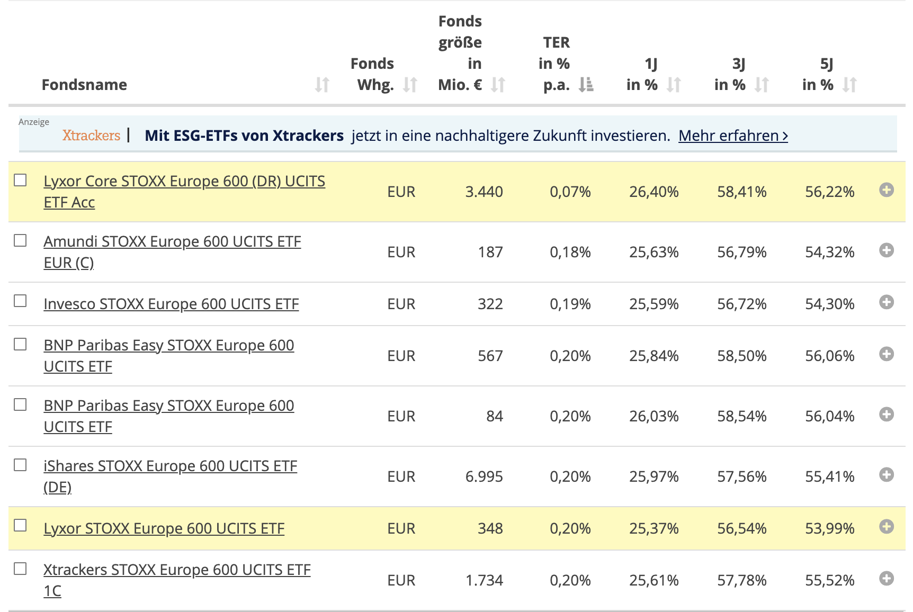

### Target Portfolio

| ETF                                                                                                                                                                                                                                                                              | ISIN         | WKN    | Anteil | Betrag   |
| -------------------------------------------------------------------------------------------------------------------------------------------------------------------------------------------------------------------------------------------------------------------------------- | ------------ | ------ | ------ | -------- |
| [Lyxor Core MSCI World (DR) UCITS ETF - Acc](https://www.justetf.com/de/etf-profile.html?assetClass=class-equity&index=MSCI%2BWorld&groupField=none&sortField=ter&sortOrder=asc&distributionPolicy=distributionPolicy-accumulating&from=search&isin=LU1781541179)                | LU1781541179 | LYX0YD | 50%    | 15.000 € |
| [Xtrackers MSCI Emerging Markets UCITS ETF 1C](https://www.justetf.com/de/etf-profile.html?assetClass=class-equity&index=MSCI%2BEmerging%2BMarkets&groupField=none&distributionPolicy=distributionPolicy-accumulating&sortField=ter&sortOrder=asc&from=search&isin=IE00BTJRMP35) | IE00BTJRMP35 | A12GVR | 30%    | 9.000 €  |
| [Lyxor Core STOXX Europe 600 (DR) UCITS ETF Acc](https://www.justetf.com/de/etf-profile.html?assetClass=class-equity&index=STOXX%25C2%25AE%2BEurope%2B600&groupField=none&sortField=ter&sortOrder=asc&from=search&isin=LU0908500753)                                             | LU0908500753 | LYX0Q0 | 20%    | 6.000 €  |

## Steuern in Deutschland

[ETF und Steuern: das Investmentsteuergesetz](https://www.justetf.com/de/news/etf/etf-und-steuern-das-neue-investmentsteuergesetz-ab-2018.html)

### Thesaurierend

- keine Steuern während der Ansparphase
- Steuern werden fällig beim Verkauf
- 30% sind steuerfrei

#### Beispielrechnung: Depowert

|                                  | Betrag  |
| :------------------------------: | :-----: |
|          Einmal-Invest           | 30.000€ |
|      monatlich für 10 Jahre      | 1.000€  |
|  durchschnittliche Rendite p.a.  |  7,0%   |
| durchschnittliche Inflation p.a. |  2,5%   |

```js
const durchschnRendite = 0.07;
const einmalInvest = 30000;
const sparRate = 12 * 1000;
let summe = einmalInvest;
const laufzeit = 10;
for (let i = 0; i < laufzeit; i++) {
  summe = summe * (1 + durchschnRendite) + sparRate;
}
// Vorabpauschale wird durch Steuerpauschbetrag
// abgegolten. Daher fallen keine Steuern an.
const inflation = 2.5 / 100;
const kaufkraft = summe / (1 + inflation) ** laufzeit;
const formatter = new Intl.NumberFormat('de-DE', {
  style: 'currency',
  currency: 'EUR',
});
console.log(
  '| ' + 'nach ' + laufzeit + ' Jahren |',
  formatter.format(summe) + ' |',
  formatter.format(kaufkraft) + ' |'
);
```

|                |    Depowert    |  Kaufkraft   |
| :------------: | :------------: | :----------: |
| nach 10 Jahren |  224.811,92 €  | 175.622,71 € |
| nach 20 Jahren |  608.036,44 €  | 371.066,97 € |
| nach 30 Jahren | 1.361.897,09 € | 649.274,47 € |

#### Beispielrechnung: Versteuerung bei Verkauf

```js
const laufzeit = 10;
const einzahlung = 30000 + 12 * 1000 * laufzeit;
const depotWert = 224811.92;
// Vorabpauschale: jährlich
const durchschnRendite = 0.07;
const durchschnBasisZins = 0.3 / 100;
const einmalInvest = 30000;
const sparRate = 12 * 1000;
const steuerRate = 0.7;
let summe = einmalInvest;
let summeVorabPauschale = 0;
for (let i = 0; i < laufzeit; i++) {
  // Basisertrag = ETF-Wert zum Jahresanfang x Basiszins x 0,7; mind. 0
  const basisertrag = summe * durchschnBasisZins * steuerRate;
  // Vorabpauschale = Basisertrag - Ausschüttungen; mind. 0
  const vorabPauschale = basisertrag - 0;
  summeVorabPauschale += vorabPauschale;
  // Besteuerung der Vorabpauschale: Vorabpauschale x 70% x 26,375%
  // Vorabpauschale kann bis 801€ durch Sparerpauschbetrag abgegolten werden
  //   const steuerVorabPausch = vorabPauschale * 0.7 * 0.26375;
  summe = summe * (1 + durchschnRendite) + sparRate;
}
// Abgeltungssteuer
const rendite = depotWert - einzahlung;
// Auf die Vorabpauschale wurde bereits Steuer gezahlt (abgegolten durch Freistellungsauftrag)
const zuVersteuern = (rendite - summeVorabPauschale) * steuerRate;
// Bei Verkauf: Abgeltungsteuer inkl. Solidaritätszuschlag
const abgeltungsSteuer = 26.375 / 100;
const steuer = zuVersteuern * abgeltungsSteuer;
// Nettoertrag
const nettoErtrag = depotWert - steuer;
const formatter = new Intl.NumberFormat('de-DE', {
  style: 'currency',
  currency: 'EUR',
});
console.log(
  '| Summe Vorabpauschale |',
  formatter.format(summeVorabPauschale) + ' |'
);
console.log(
  '| kompensierte Steuern auf Vorabpauschale |',
  formatter.format(summeVorabPauschale * steuerRate * abgeltungsSteuer) + ' |'
);
console.log('| Steuer |', formatter.format(steuer) + ' |');
console.log('| Netto-Depotwert |', formatter.format(nettoErtrag) + ' |');
console.log('| Eingezahlt |', formatter.format(einzahlung) + ' |');
console.log('| Vorsteuer-Rendite |', formatter.format(rendite) + ' |');
console.log('| Stuersatz |', ((100 * steuer) / rendite).toFixed(2) + '% |');
```

|                                         |    Betrag    |
| :-------------------------------------: | :----------: |
|          Summe Vorabpauschale           |  2.244,36 €  |
| kompensierte Steuern auf Vorabpauschale |   414,36 €   |
|                 Steuer                  | 13.397,79 €  |
|             Netto-Depotwert             | 211.414,13 € |
|               Eingezahlt                | 150.000,00 € |
|            Vorsteuer-Rendite            | 74.811,92 €  |
|                Stuersatz                |    17.91%    |
